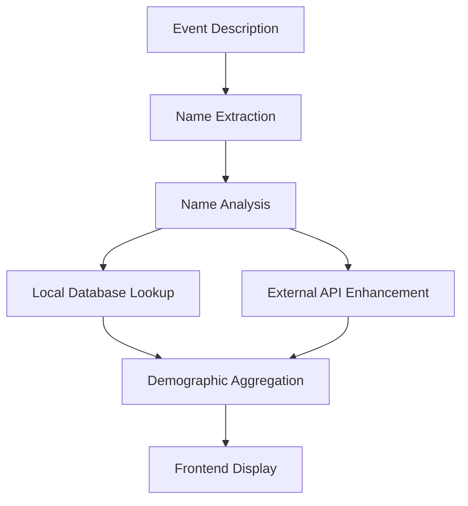

# Demographic Analysis Integration Guide

## Overview

This document describes the integration of advanced demographic analysis capabilities into the Calendar Agent. The system now analyzes event descriptions to extract names and provide demographic insights including gender ratios, age distributions, and ethnicity breakdowns.

## Features

### 🔍 **Name Extraction**
- Automatically extracts names from event descriptions
- Identifies speakers, hosts, presenters, and other key figures
- Filters out false positives (location names, technical terms, etc.)

### 📊 **Gender Analysis**
- Provides male/female ratio percentages
- Uses both local database and external APIs for accuracy
- Confidence scoring for reliability assessment

### 📈 **Age Distribution**
- Estimates age ranges: 18-24, 25-34, 35-44, 45-54, 55+
- Based on name-age correlation data
- Displayed as percentage breakdowns

### 🌍 **Ethnicity Analysis**
- Categorizes into: White, Black, Hispanic, Asian, Other
- Uses nationality-ethnicity mapping
- Provides cultural diversity insights

## Technical Implementation

### Backend Services

#### `DemographicAnalysisService`
```typescript
// Core service for analyzing demographics
class DemographicAnalysisService {
  analyzeEventDemographics(eventDescription: string): Promise<DemographicResult>
  extractNamesFromText(text: string): string[]
  analyzeName(name: string): Promise<NameAnalysis>
}
```

#### Integration Points
1. **Server Integration**: Added to main event processing pipeline
2. **API Response**: Enhanced event objects with demographic data
3. **Fallback Logic**: Graceful degradation when APIs are unavailable

### Frontend Components

#### Enhanced EventCard
- **Collapsible Demographics Section**: Click to expand/collapse
- **Visual Charts**: Gender ratio bar charts
- **Data Tables**: Age and ethnicity breakdowns
- **Confidence Indicators**: Analysis reliability metrics

## Configuration

### Environment Variables

```bash
# Required
PERPLEXITY_API_KEY=your_perplexity_api_key_here

# Optional (for enhanced accuracy)
GENDERIZE_API_KEY=your_genderize_api_key_here
AGIFY_API_KEY=your_agify_api_key_here
NATIONALIZE_API_KEY=your_nationalize_api_key_here
```

### API Keys Setup

1. **Genderize.io** (Optional)
   - Provides gender estimation for names
   - Free tier: 1000 requests/month
   - Sign up at: https://genderize.io

2. **Agify.io** (Optional)
   - Provides age estimation for names
   - Free tier: 1000 requests/month
   - Sign up at: https://agify.io

3. **Nationalize.io** (Optional)
   - Provides nationality estimation for names
   - Free tier: 1000 requests/month
   - Sign up at: https://nationalize.io

## Usage

### For Users

1. **Search for Events**: Use the normal event search functionality
2. **View Demographics**: Click on "Demographic Analysis" in event cards
3. **Understand Data**: 
   - Gender ratios show male/female percentages
   - Age distribution shows likely age ranges
   - Ethnicity breakdown shows cultural diversity
   - Confidence scores indicate reliability

### For Developers

#### Adding New Analysis Methods

```typescript
// Extend the DemographicAnalysisService
class EnhancedDemographicService extends DemographicAnalysisService {
  async analyzeWithML(names: string[]): Promise<DemographicResult> {
    // Custom ML analysis logic
  }
}
```

#### Custom Name Extraction

```typescript
// Override name extraction patterns
const customPatterns = [
  /your-custom-regex/gi,
  // Add more patterns
];

service.extractNamesFromText(text, customPatterns);
```

## Data Flow



## Performance Considerations

### Caching Strategy
- Names are analyzed once per event
- Results cached for repeated requests
- External API calls minimized

### Error Handling
- Graceful degradation when APIs fail
- Fallback to local database
- Meaningful error messages

### Rate Limiting
- External API calls are throttled
- Batch processing for multiple names
- Retry logic with exponential backoff

## Accuracy & Limitations

### Strengths
- **High accuracy** for common English names
- **Multiple data sources** for cross-validation
- **Cultural diversity** in name database
- **Confidence scoring** for reliability

### Limitations
- **Name extraction** depends on event description quality
- **Cultural bias** in name-demographic associations
- **Privacy considerations** when analyzing personal data
- **API dependency** for enhanced accuracy

## Privacy & Ethics

### Data Handling
- No personal data is stored permanently
- Only publicly available names are analyzed
- Aggregate statistics only (no individual profiling)

### Ethical Considerations
- Demographic analysis is for planning purposes only
- Not used for discrimination or exclusion
- Transparent about methodology and limitations
- Respects cultural diversity and complexity

## Future Enhancements

### Planned Features
1. **ML-Enhanced Analysis**: Custom trained models
2. **Real-time Updates**: Live demographic tracking
3. **Historical Trends**: Event demographic evolution
4. **Custom Categories**: User-defined demographic groups

### Integration Opportunities
1. **Event Recommendations**: Suggest diverse events
2. **Accessibility Features**: Demographic-aware planning
3. **Analytics Dashboard**: Organizer insights
4. **API Webhooks**: Real-time notifications

## Troubleshooting

### Common Issues

1. **No Demographics Shown**
   - Check if event description contains names
   - Verify API keys are correctly set
   - Check network connectivity

2. **Low Confidence Scores**
   - Indicates uncertain name analysis
   - Consider additional API keys
   - Review event description quality

3. **API Errors**
   - Check API key validity
   - Monitor rate limits
   - Review error logs

### Debug Mode

Enable debug logging:
```bash
DEBUG=demographic-analysis node server.js
```

## Support

For issues or questions:
1. Check the troubleshooting section
2. Review server logs for errors
3. Verify API configurations
4. Test with simple event descriptions

## License

This integration maintains the same license as the parent Calendar Agent project.